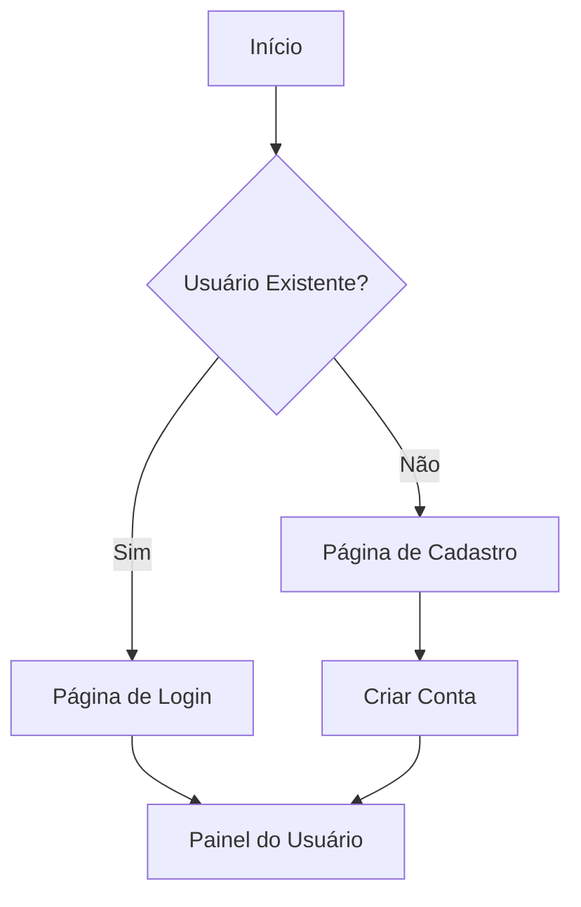
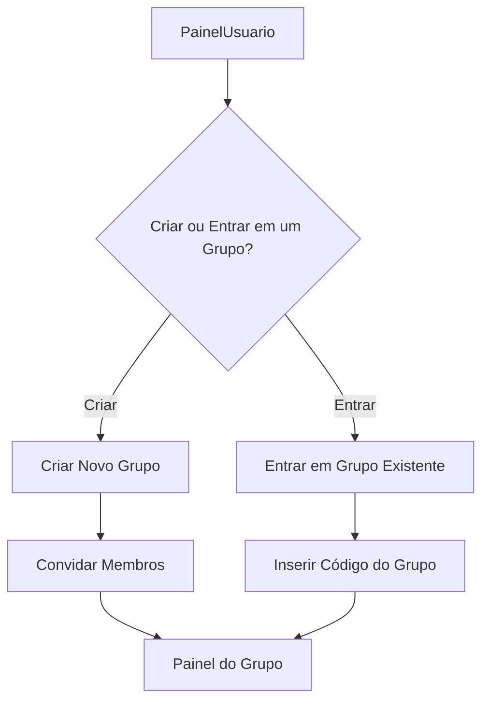
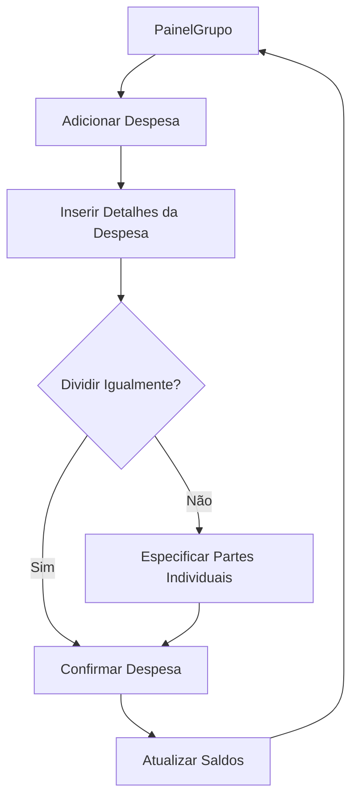
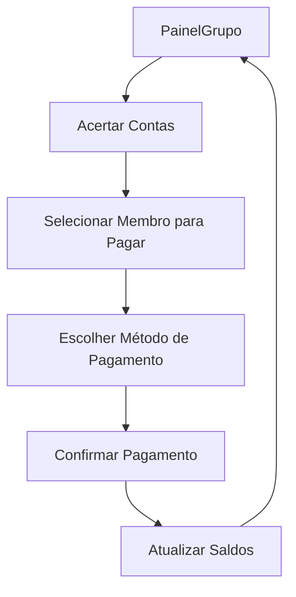
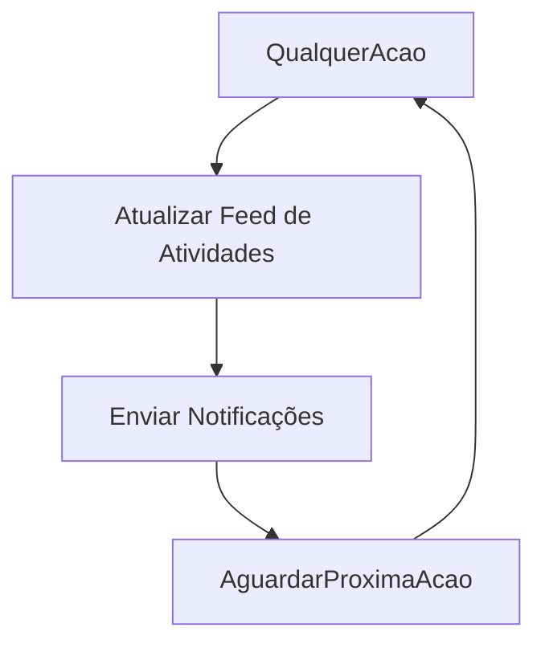
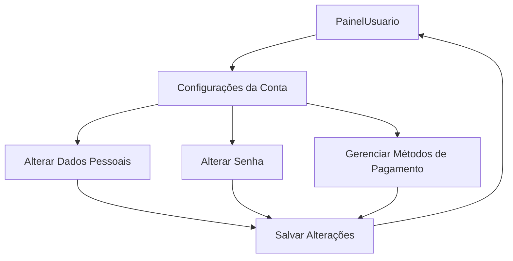

Fluxogramas para Aplicativo de Compartilhamento de Despesas
Este documento contém fluxogramas modelados em MermaidJS que representam as funcionalidades principais de um aplicativo de compartilhamento de despesas semelhante ao Splitwise e Tricount. Esses fluxogramas cobrem autenticação de usuário, gerenciamento de grupos, adição de despesas, acerto de contas, notificações e configurações de conta.

1. Fluxo de Autenticação de Usuário

Explicação:

Os usuários começam decidindo se são usuários existentes.
Usuários existentes vão para a página de login; novos usuários vão para a página de cadastro.
Após a autenticação ou criação da conta, os usuários são direcionados ao seu painel.

2. Fluxo de Criação e Gerenciamento de Grupo

Explicação:

A partir do painel, os usuários escolhem criar um novo grupo ou entrar em um existente.
Criar um grupo envolve convidar membros; entrar requer inserir um código de grupo.
Ambos os caminhos levam ao painel do grupo.

3. Fluxo de Adição de Despesa

Explicação:

Os usuários podem adicionar despesas a partir do painel do grupo.
Eles inserem os detalhes da despesa e escolhem como dividir o valor.
O aplicativo atualiza os saldos conforme necessário e retorna ao painel do grupo.

4. Fluxo de Acerto de Contas

Explicação:

Os usuários iniciam o acerto de contas a partir do painel do grupo.
Eles selecionam um membro para pagar e escolhem um método de pagamento.
Após a confirmação, o aplicativo atualiza os saldos e retorna ao painel.

5. Fluxo de Notificações e Feed de Atividades

Explicação:

Qualquer ação realizada (como adicionar despesas ou acertar contas) atualiza o feed de atividades.
O aplicativo envia notificações aos membros relevantes.
O sistema aguarda a próxima ação para continuar o ciclo.

6. Fluxo de Configurações de Conta

Explicação:

Os usuários podem acessar as configurações da conta a partir do painel.
Eles podem alterar dados pessoais, senhas ou gerenciar métodos de pagamento.
Após salvar as alterações, são redirecionados de volta ao painel.
